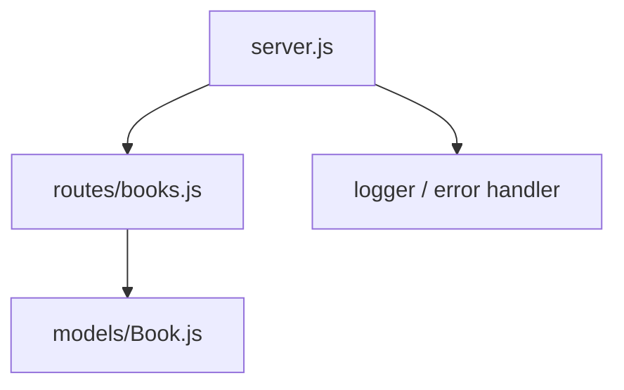

# Implementation Plan - Online Bookstore Management API

This plan outlines the steps and structure for building the Online Bookstore Management API using Node.js, Express, and MongoDB.

## User Review Required

> [!IMPORTANT]
> - **MongoDB Connection**: The system will default to connecting to a local MongoDB instance (`mongodb://127.0.0.1:27017/bookstore`) unless custom credentials are provided in `.env`.
> - **Postman Collection**: A complete Postman collection JSON file (`bookstore-api.postman_collection.json`) will be generated to meet the submission requirements.

## Proposed Changes

We will create a standard Express application structure.

---

### Environment Setup

#### [NEW] [package.json](file:///c:/Users/Abdul%20Samad%20Khattak/OneDrive/Desktop/Web%20Assignment2/package.json)
Initialize Node.js project and specify dependencies:
- `express`
- `mongoose`
- `dotenv`
- `nodemon` (as `devDependencies` for auto-reloading during development)

#### [NEW] [.env](file:///c:/Users/Abdul%20Samad%20Khattak/OneDrive/Desktop/Web%20Assignment2/.env)
Define environment configuration.
- `PORT` (default: 5000)
- `MONGODB_URI` (default: `mongodb://127.0.0.1:27017/bookstore`)

#### [NEW] [.env.example](file:///c:/Users/Abdul%20Samad%20Khattak/OneDrive/Desktop/Web%20Assignment2/.env.example)
Define example environment configuration without sensitive information.

---

### Database Layer

#### [NEW] [Book.js](file:///c:/Users/Abdul%20Samad%20Khattak/OneDrive/Desktop/Web%20Assignment2/models/Book.js)
Define the mongoose schema and model for `Book`:
- `title` (String, required)
- `author` (String, required)
- `genre` (String)
- `price` (Number, required)
- `publishedDate` (Date)
- `inStock` (Boolean, default: true)

---

### Routing & Controllers

#### [NEW] [books.js](file:///c:/Users/Abdul%20Samad%20Khattak/OneDrive/Desktop/Web%20Assignment2/routes/books.js)
Implement API endpoints with robust validation:
1. `GET /api/books` - Retrieve all books (with search query params `author`/`genre` and pagination support `page`/`limit`).
2. `GET /api/books/:id` - Retrieve book by ID.
3. `POST /api/books` - Create a new book (validates required fields: `title`, `author`, `price`).
4. `PUT /api/books/:id` - Update a book by ID (validates fields and path parameters).
5. `DELETE /api/books/:id` - Delete a book by ID.

---

### Application Entry Point & Middleware

#### [NEW] [server.js](file:///c:/Users/Abdul%20Samad%20Khattak/OneDrive/Desktop/Web%20Assignment2/server.js)
Bootstrap the application:
- Express setup and body parsing JSON middleware.
- Request logging middleware (logs Method, Endpoint, Timestamp).
- Connect to MongoDB using Mongoose.
- Set up API routes under `/api/books`.
- Implement global error handler (catches database CastErrors, validation errors, and undefined routes) returning a standardized JSON response.

---

### Testing & Postman Collection

#### [NEW] [bookstore-api.postman_collection.json](file:///c:/Users/Abdul%20Samad%20Khattak/OneDrive/Desktop/Web%20Assignment2/bookstore-api.postman_collection.json)
Create a Postman Collection JSON containing requests for all endpoints, including examples of search and pagination, to satisfy the requirement of "Postman collection showing all API routes tested".

---

## Verification Plan

### Automated Tests
- Since unit tests are not strictly requested, we will run the server locally and verify using a Node script or Postman/curl calls.
- We will construct an automated Javascript verification script (`verify.js`) to programmatically run requests against the running Express API to ensure all features function as expected (search, pagination, validation, etc.).

### Manual Verification
- Start the server using `npm run dev` and ensure connection to MongoDB is established.
- Run tests via the verification script.
- Export/verify the Postman collection.
